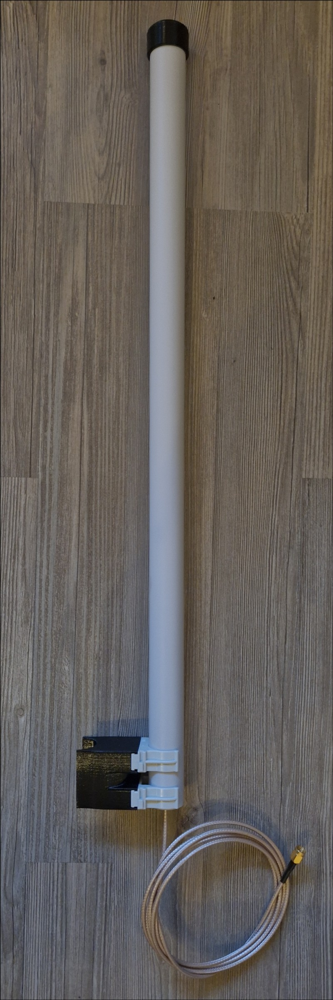
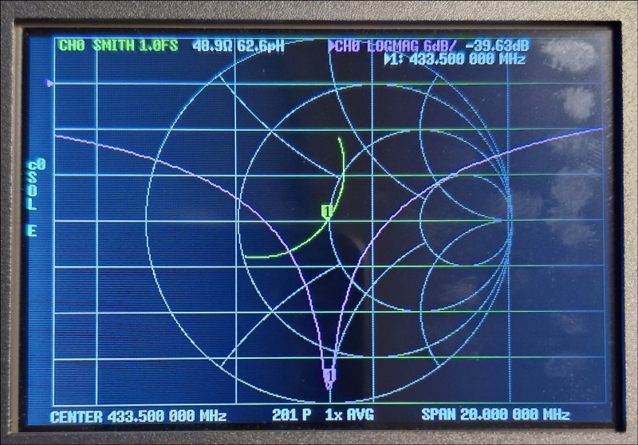
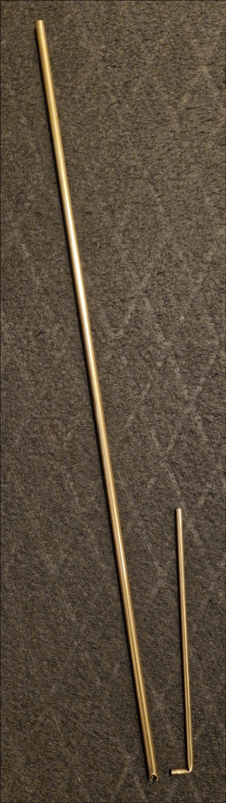
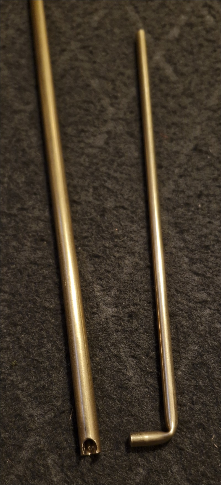
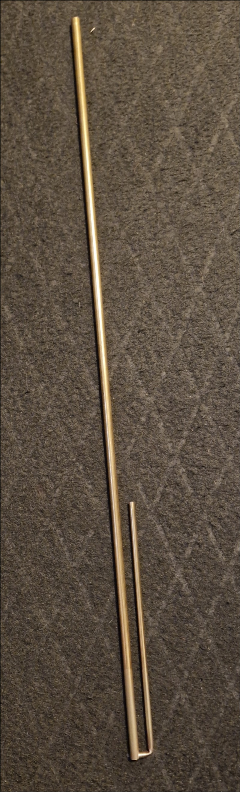
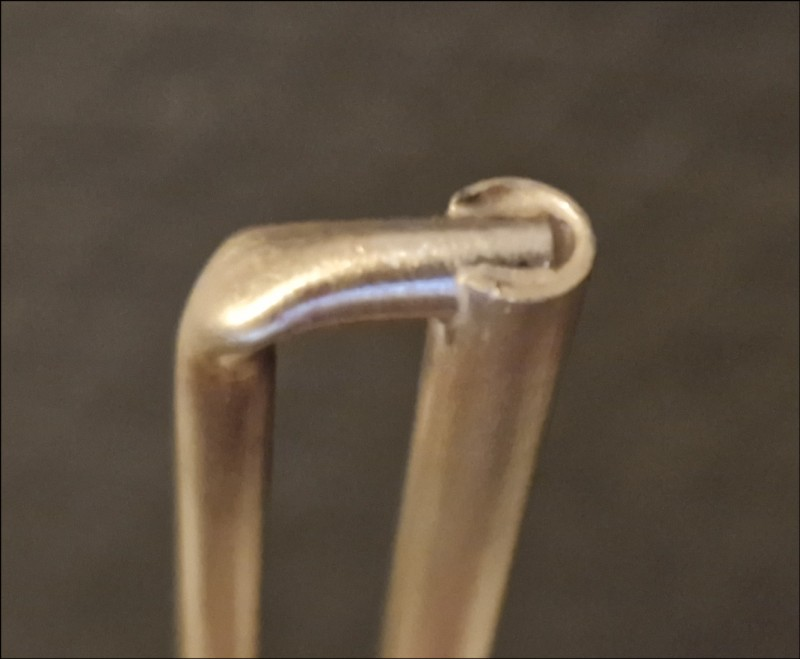
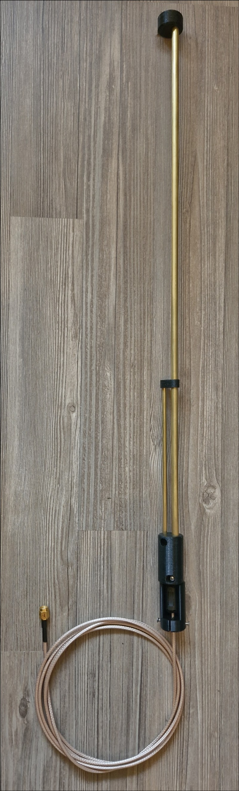

# Construction of a weather proof J Pole antenna for 433..434 MHz
This is a contruction of a weather proof J Pole antenna which can be used as a stationary antenna e.g. for [MeshCom](https://icssw.org/meshcom). The antenna is tuned to 433.5MHz resonance frequency and has a return loss better than 15dB within +/-2MHz. 

The basic calculations for the antenna are made with [John Parfrey's (M0UKD) excellent J Pole/Slim Jim online calculator](https://m0ukd.com/calculators/slim-jim-and-j-pole-calculator). The velocity factor vf for the used material is about 0.95. The plastic parts and the covering tube are reducing the resonance frequency by about 10MHz (so the calculation frequency must be set to 443.5MHz).

# Material

## Common parts
* Brass tube 6 mm diameter
* Brass tube 4 mm diameter
* Electric installation PVC tube 25 mm diameter
* Clamps for installation tube 25 mm (optional, depends on mounting)
* 2x M5 x 9.5 x 7.1 threaded heat set inserts (optional, depends on mounting)
* 2x M2,5 x 6 countersunk screw (stainless steel if possible)
* 1x M3 x 10 Nylon
* 1x DIN912 M3 x 8 (stainless steel if possible)
* Clip-on ferrite about 13 mm diameter, about 26 mm length
* A piece of RG/RD-316 with an SMA connector (isolation parts are made of PTFE, so no problems at soldering the feedpoint)

## 3D pinted parts
* J-Pole_433_Base, J-Pole_433_Bot1/2, J-Pole_433_Spacer and J-Pole_433_Top are made of PETG with 15% infill. J-Pole_433_Clamp is made of PETG with 50% infill. 2.1/2.4 mm holes are threaded with a thread cutter for M2.5 respectively M3.
* J-Pole_433_Cap is made of Shore 95A TPU (Eryone) with 100% infill.

All CAD files (FCStd format) can be found in the subdirectory "FreeCAD-Data". STL files for individual slicing can be found in the subdirectory "STL-Data". Ready-to-print BGCODE for Prusa MK4 printers can be found in the subdirectory "Prusa3D-Data".

# Contruction
Details about measures and assembly of the antenna can be found in [J-Pole_433MHz_DL9SEC.pdf](https://github.com/dl9sec/J-Pole_433MHz/blob/main/J-Pole_433MHz_DL9SEC.pdf).

1. The 6mm brass tube is cutted to the respective length. At one end a 4mm hole must be drilled (see drawing).
2. The 4mm brass tube should be simply bended carefully and then cutted to the given length.

3. The 4mm tube is sticked into the drilled hole (see drawing) and brazed with brasing alloy (e.g. silver alloy, 650°C melting point).

4. The spacer ("J-Pole_433_Spacer") is put on the tubes to stabilize the J.
5. The coaxial cable is soldered to the feedpoint (see drawing). Take care, that if the 6mm tube is on the left, the cable must be on the backside!
6. The shells "J-Pole_433_Bot1/2" are put arond the bottom of the antenna. The upper screw is the nylon one, the lower screw is the metal one.
7. Put the ferrite choke around the coax cable, then put "J-Pole_433_Base" around the cable and push both towards the antenna bottom.

8. Put all together into the PVC tube (it may be better to insert the "J-Pole_433_Top" only after the antenna has been pushed into the tube).
7. Attach the antenna with the two screws at the bottom of the tube.
8. Put "J-Pole_433_Cap" on the tot ob the tube.

The pole clamp adapter "J-Pole_433_Clamp" is optional. Two tube clamps can be attached by inserting two threaded heat set inserts. The adapter can be attached to a 25mm pole (e.g. at a weather station).

The parts are modeled with [FreeCAD](https://www.freecadweb.org/).

Copyright (C) 2024 by Thorsten Godau (DL9SEC). All stuff here is licensed under [Creative Commons Attribution-ShareAlike 4.0 International](https://creativecommons.org/licenses/by-sa/4.0).
